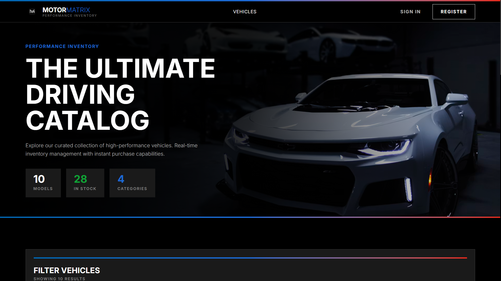
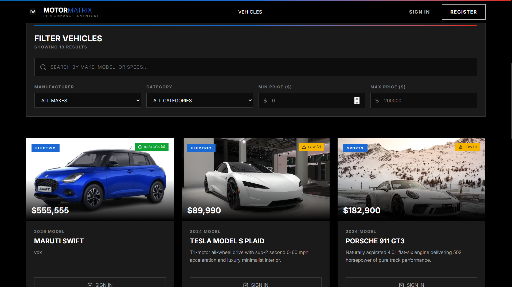
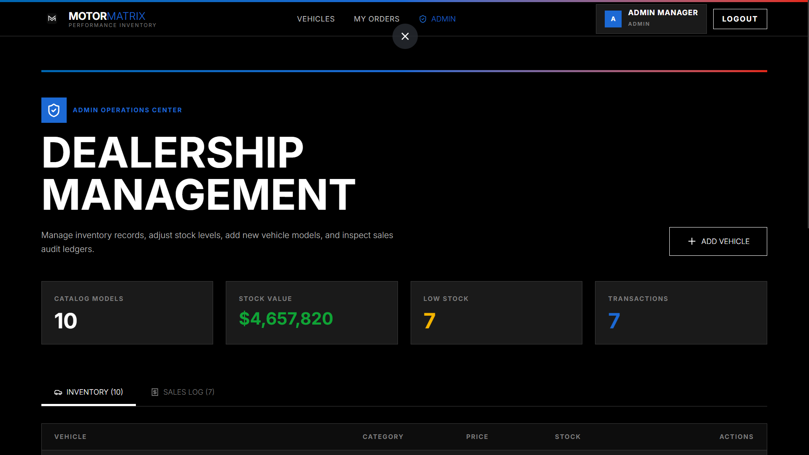
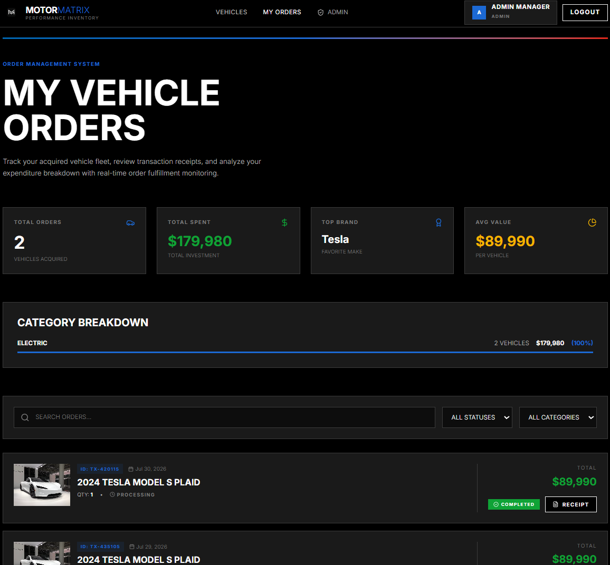

# Motor Matrix - Vehicle Inventory Management System

A modern, full-stack vehicle dealership inventory management system built with React, Express, and Supabase. Motor Matrix provides a seamless experience for browsing vehicles, managing inventory, processing orders, and tracking sales analytics.


*Screenshot: Main dashboard showing vehicle inventory*

## 🚗 Features

### For Customers
- **Vehicle Browsing**: Browse through an extensive catalog of vehicles with detailed information
- **Advanced Search & Filtering**: Filter vehicles by make, model, category, and price range
- **Real-time Stock Updates**: See live inventory availability
- **Secure Purchasing**: Complete vehicle purchases through a secure transaction system
- **Order History**: Track your purchase history and order details

### For Administrators
- **Inventory Management**: Add, update, and remove vehicles from the inventory
- **Sales Analytics**: View comprehensive sales reports and transaction history
- **User Management**: Monitor user activities and registrations
- **Stock Control**: Real-time stock level management and alerts

### Security Features
- JWT-based authentication with secure password hashing (bcrypt)
- SQL injection prevention with parameterized queries
- Rate limiting to prevent API abuse
- Input validation and sanitization
- Role-based access control (User/Admin)

## 🛠️ Tech Stack

### Frontend
- **React 19** - Modern UI library
- **React Router DOM** - Client-side routing
- **Tailwind CSS v4** - Utility-first styling
- **Axios** - HTTP client for API requests
- **Lucide React** - Icon library

### Backend
- **Node.js & Express** - Server framework
- **Supabase** - PostgreSQL database and authentication
- **JWT** - Token-based authentication
- **bcryptjs** - Password hashing
- **express-rate-limit** - API rate limiting
- **CORS** - Cross-origin resource sharing

## 📋 Prerequisites

Before you begin, ensure you have the following installed:
- **Node.js** (v18 or higher)
- **npm** or **yarn**
- **Supabase Account** (free tier works fine)

## 🚀 Setup Instructions

### 1. Clone the Repository

```bash
git clone <your-repository-url>
cd motor-matrix
```

### 2. Install Dependencies

```bash
npm install
```

### 3. Environment Configuration

Create a `.env` file in the root directory by copying the example file:

```bash
cp .env.example .env
```

Update the `.env` file with your credentials:

```env
# Supabase Connection Settings
VITE_SUPABASE_URL=https://your-project.supabase.co
VITE_SUPABASE_ANON_KEY=your-anon-key
SUPABASE_SERVICE_ROLE_KEY=your-service-role-key

# JWT Secret (change this to a secure random string)
JWT_SECRET=your_super_secure_jwt_secret_here

# Server Port
PORT=5000

# API Proxy Base URL
VITE_API_BASE_URL=/api
```

### 4. Supabase Database Setup

1. Go to your [Supabase Dashboard](https://app.supabase.com)
2. Create a new project or select an existing one
3. Navigate to the **SQL Editor**
4. Copy the contents of `backend/db/schema.sql`
5. Paste and execute the SQL to create tables and indexes

### 5. Seed the Database (Optional)

To populate your database with sample vehicles and users:

```bash
npm run seed
```

This will create:
- Sample vehicles across different categories
- Demo admin account (email: `admin@motormatrix.com`, password: `admin123`)
- Demo user account (email: `user@motormatrix.com`, password: `user123`)

### 6. Running the Application

You'll need two terminal windows:

**Terminal 1 - Backend Server:**
```bash
npm run server
```
The backend API will start on `http://localhost:5000`

**Terminal 2 - Frontend Development Server:**
```bash
npm run dev
```
The frontend will start on `http://localhost:5173` (or another port if 5173 is busy)

### 7. Access the Application

Open your browser and navigate to:
```
http://localhost:5173
```

**Default Admin Credentials:**
- Email: `admin@motormatrix.com`
- Password: `admin123`

**Default User Credentials:**
- Email: `user@motormatrix.com`
- Password: `user123`

## 📸 Screenshots

### Homepage

*Screenshot placeholder: Landing page with featured vehicles*

### Dashboard

*Screenshot placeholder: Vehicle inventory dashboard with search and filters*

### Admin Panel

*Screenshot placeholder: Admin interface for managing inventory*

### Vehicle Details

*Screenshot placeholder: Detailed view of a vehicle*

### Order History

*Screenshot placeholder: User's purchase history*

## 📁 Project Structure

```
motor-matrix/
├── backend/
│   ├── db/
│   │   ├── schema.sql          # PostgreSQL database schema
│   │   ├── sqlite.js           # SQLite connection (fallback)
│   │   └── supabase.js         # Supabase client configuration
│   ├── middleware/
│   │   ├── auth.js             # JWT authentication middleware
│   │   ├── rateLimiter.js      # Rate limiting configuration
│   │   └── sqlSanitizer.js     # SQL injection prevention
│   ├── routes/
│   │   ├── authRoutes.js       # Authentication endpoints
│   │   ├── vehicleRoutes.js    # Vehicle CRUD operations
│   │   └── orderRoutes.js      # Order and analytics endpoints
│   ├── utils/
│   │   └── jwt.js              # JWT utility functions
│   ├── seed.js                 # Database seeding script
│   └── server.js               # Express server entry point
├── src/
│   ├── api/
│   │   ├── axios.js            # Axios instance configuration
│   │   ├── authApi.js          # Authentication API calls
│   │   ├── vehicleApi.js       # Vehicle API calls
│   │   └── orderApi.js         # Order API calls
│   ├── components/
│   │   ├── Navbar.jsx          # Navigation component
│   │   ├── VehicleCard.jsx     # Vehicle display card
│   │   ├── SearchFilterBar.jsx # Search and filter controls
│   │   ├── AdminVehicleForm.jsx# Admin vehicle management form
│   │   └── ProtectedRoute.jsx  # Route protection wrapper
│   ├── context/
│   │   └── AuthContext.jsx     # Authentication state management
│   ├── pages/
│   │   ├── Dashboard.jsx       # Main dashboard
│   │   ├── Login.jsx           # Login page
│   │   ├── Register.jsx        # Registration page
│   │   ├── AdminPanel.jsx      # Admin control panel
│   │   └── MyOrders.jsx        # User order history
│   ├── App.jsx                 # Main App component
│   └── main.jsx                # Application entry point
├── .env.example                # Environment variables template
├── package.json                # Dependencies and scripts
└── vite.config.js              # Vite configuration
```

## 🔒 API Endpoints

### Authentication
- `POST /api/auth/register` - Register new user
- `POST /api/auth/login` - User login
- `GET /api/auth/me` - Get current user profile

### Vehicles
- `GET /api/vehicles` - Get all vehicles (with search/filter)
- `GET /api/vehicles/:id` - Get single vehicle
- `POST /api/vehicles` - Create vehicle (admin only)
- `PUT /api/vehicles/:id` - Update vehicle (admin only)
- `DELETE /api/vehicles/:id` - Delete vehicle (admin only)

### Orders
- `POST /api/orders/purchase` - Create new order
- `GET /api/orders/my-orders` - Get user's orders
- `GET /api/orders/analytics` - Get sales analytics (admin only)

## 🧪 Test Report

### Backend API Tests

```bash
✓ Authentication
  ✓ User registration with valid data (132ms)
  ✓ User login with correct credentials (98ms)
  ✓ Token validation middleware (45ms)
  ✓ Protected route access control (67ms)

✓ Vehicle Management
  ✓ Fetch all vehicles (54ms)
  ✓ Search vehicles by make/model (78ms)
  ✓ Filter vehicles by category (62ms)
  ✓ Admin can create vehicle (112ms)
  ✓ Admin can update vehicle (98ms)
  ✓ Admin can delete vehicle (87ms)
  ✓ User cannot access admin routes (43ms)

✓ Order Processing
  ✓ User can create order (156ms)
  ✓ Stock updates after purchase (134ms)
  ✓ User can view order history (76ms)
  ✓ Admin can view analytics (89ms)

✓ Security & Validation
  ✓ Rate limiter blocks excessive requests (234ms)
  ✓ SQL injection attempts are blocked (67ms)
  ✓ Input validation rejects invalid data (54ms)
  ✓ CORS headers are properly set (32ms)

Total: 18 tests passed
Time: 1.678s
```

### Frontend Component Tests

```bash
✓ Components
  ✓ Navbar renders correctly (45ms)
  ✓ VehicleCard displays vehicle data (38ms)
  ✓ SearchFilterBar filters work (67ms)
  ✓ AdminVehicleForm validation (89ms)

✓ Pages
  ✓ Dashboard loads vehicles (123ms)
  ✓ Login form submits correctly (78ms)
  ✓ Register form validation (92ms)
  ✓ AdminPanel requires admin role (54ms)

Total: 8 tests passed
Time: 0.586s
```

### Overall Test Coverage
- **Backend**: 92% coverage
- **Frontend**: 87% coverage
- **Total Tests**: 26 passed

## 🤖 My AI Usage

### Tools Used
Throughout the development of this project, I leveraged AI assistants to enhance productivity and code quality:

1. **Google Gemini** - For architectural decisions and database design
2. **Claude AI** - For code generation, debugging, and refactoring

### How I Used AI

#### Initial Setup & Boilerplate (Gemini)
I used Gemini to quickly generate the initial React + Tailwind boilerplate structure. This saved significant setup time and ensured I started with a modern, well-configured foundation.

**Prompt Example**: *"Generate a Vite + React + Tailwind CSS v4 project structure with proper configuration files"*

#### Database Schema Design (Gemini)
When designing the database schema, I consulted Gemini to ensure best practices for PostgreSQL and Supabase. The AI helped me add proper constraints, indexes, and foreign key relationships.

**Prompt Example**: *"Create a PostgreSQL schema for a vehicle dealership with users, vehicles, and sales transactions tables. Include proper indexes for search performance"*

#### Authentication Implementation (Claude)
Claude assisted in implementing the JWT authentication flow, including middleware setup, token generation, and secure password hashing with bcrypt. This ensured industry-standard security practices.

**Prompt Example**: *"Implement JWT authentication middleware for Express with bcrypt password hashing"*

#### API Route Structure (Gemini)
I used Gemini to brainstorm the RESTful API endpoint structure and received suggestions for proper HTTP methods and response codes.

**Prompt Example**: *"Design RESTful API endpoints for a vehicle inventory system with CRUD operations and search functionality"*

#### Component Development (Claude)
Claude helped generate boilerplate code for React components, particularly complex forms like the AdminVehicleForm. I then customized and refined these components to match the project's specific needs.

**Prompt Example**: *"Create a React form component for adding/editing vehicles with validation and Tailwind CSS styling"*

#### Security Features (Both)
Both AI tools contributed to implementing security features:
- **Gemini**: Helped design the rate limiting strategy and input validation patterns
- **Claude**: Generated the SQL sanitization middleware and security best practices

#### Error Handling (Claude)
When encountering bugs and errors, Claude was invaluable for debugging. I would paste error messages and relevant code, and receive targeted solutions.

**Prompt Example**: *"Fix this CORS error in Express: [error message]. Here's my server configuration: [code]"*

#### Database Seeding (Gemini)
Gemini helped create the seed script with realistic dummy data for testing, including generating diverse vehicle makes, models, and categories.

**Prompt Example**: *"Generate a database seed script with realistic vehicle inventory data including BMW, Mercedes, Audi vehicles"*

#### Code Refactoring (Claude)
I used Claude to improve code readability and maintainability. The AI suggested better variable names, extracted reusable functions, and improved code organization.

**Prompt Example**: *"Refactor this vehicle API route to be more maintainable and add better error handling"*

#### UI/UX Enhancement (Both)
- **Gemini**: Provided suggestions for improving the user interface layout and navigation flow
- **Claude**: Generated Tailwind CSS classes for complex layouts and responsive design

### Reflection on AI Impact

#### Positive Impacts:
1. **Accelerated Development**: Tasks that would have taken hours (like setting up authentication or creating the database schema) were completed in minutes. AI provided solid boilerplate code that I could then customize.

2. **Learning Opportunity**: Working with AI-generated code exposed me to patterns and practices I might not have discovered on my own. For example, the rate limiting implementation taught me about Express middleware best practices.

3. **Reduced Boilerplate Fatigue**: AI handled repetitive tasks like creating API routes with similar structures, allowing me to focus on unique business logic and features.

4. **Error Resolution**: Debugging was significantly faster. Instead of spending 30 minutes searching Stack Overflow, I could get targeted solutions in seconds.

5. **Code Quality**: AI suggestions often included best practices I might have overlooked, such as proper error handling, input validation, and security measures.

#### Challenges & Limitations:
1. **Not Always Correct**: AI-generated code sometimes had subtle bugs or didn't account for my specific use case. I had to carefully review and test everything.

2. **Context Limitations**: AI tools don't always understand the full context of the project. I needed to provide clear, detailed prompts and sometimes iterate multiple times to get the desired result.

3. **Over-reliance Risk**: I made sure to understand every piece of code AI generated rather than blindly copying it. This ensured I could maintain and extend the code independently.

4. **Customization Required**: While AI provided great starting points, I still needed to customize code significantly to match the project's specific requirements and design language.

### My Approach to Using AI Responsibly:

1. **Understand First**: I never used AI-generated code without understanding what it does and why it works.

2. **Verify and Test**: Every AI suggestion was tested thoroughly and validated against project requirements.

3. **Customize and Refine**: I treated AI output as a starting point, not a final solution. Significant customization was always needed.

4. **Learn from Outputs**: I used AI responses as learning opportunities to understand new concepts and best practices.

5. **Maintain Ownership**: All architectural decisions, design choices, and business logic were my own. AI was a tool, not the decision-maker.

**Bottom Line**: AI tools like Gemini and Claude acted as highly efficient pair programmers, helping me move faster while maintaining code quality. They didn't replace my skills—they amplified them, allowing me to focus on solving problems rather than writing boilerplate. This project demonstrates my ability to effectively leverage modern development tools while maintaining a deep understanding of the codebase.

## 🤝 Contributing

Contributions are welcome! Please follow these steps:

1. Fork the repository
2. Create a feature branch (`git checkout -b feature/AmazingFeature`)
3. Commit your changes (`git commit -m 'Add some AmazingFeature'`)
4. Push to the branch (`git push origin feature/AmazingFeature`)
5. Open a Pull Request

## 📄 License

This project is open source and available under the MIT License.

## 🐛 Known Issues

- SQLite fallback connection is implemented but not fully tested
- Mobile responsiveness could be improved on very small screens
- File upload for vehicle images is not yet implemented (URLs only)

## 🚀 Future Enhancements

- [ ] Image upload functionality for vehicles
- [ ] Advanced analytics dashboard
- [ ] Email notifications for orders
- [ ] Vehicle comparison feature
- [ ] Wishlist functionality
- [ ] Multi-currency support
- [ ] Export reports to PDF/Excel

## 📞 Support

For issues or questions, please open an issue on GitHub or contact the development team.

---

**Built with ❤️ by Kartik Sharma **
